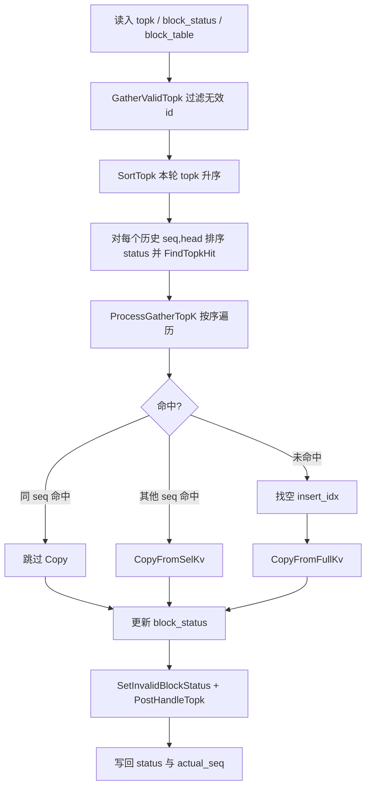

# GatherSelectionKvCache 算子实现说明

本文档说明 pip-cache 仓库中 **GatherSelectionKvCache**（PyTorch：`torch_npu.npu_gather_selection_kv_cache` / `custom_ops`）的设计目标、数据布局、核心算法、AscendC 内核实现、Host Tiling 与上层流水线集成。算子源自 CANN recipes infer，在 pip-cache 中以独立 OPP + `torch_ops_extension` 形式维护。

**实验脚本、扫参数据与 va-0.18-ess 实测结果**见：[experiments/gather_select_kvcache/gather_selection_kv_cache.md](../experiments/gather_select_kvcache/gather_selection_kv_cache.md)。

---

## 目录

1. [背景与职责](#1-背景与职责)
2. [代码结构](#2-代码结构)
3. [PyTorch 接口](#3-pytorch-接口)
4. [张量布局与三种「位置」](#4-张量布局与三种位置)
5. [跨 step 复用语义](#5-跨-step-复用语义)
6. [单 step 算法流程](#6-单-step-算法流程)
7. [AscendC 内核实现](#7-ascendc-内核实现)
8. [Host Tiling 与核间切分](#8-host-tiling-与核间切分)
9. [PyTorch 扩展与图模式](#9-pytorch-扩展与图模式)
10. [与 SparseFlashAttention 的配合](#10-与-sparseflashattention-的配合)
11. [pip-cache 中的调用链](#11-pip-cache-中的调用链)
12. [约束与限制](#12-约束与限制)
13. [构建与精度测试](#13-构建与精度测试)
14. [常见问题](#14-常见问题)

---

## 1. 背景与职责

### 1.1 问题

在 **超大 context + KV offload** 的 decode 场景中：

- **全量 KV cache（full cache）** 体积随 `max_seq_len × batch` 增长，常放在 host swap 或远端存储；
- **Indexer** 每步输出 top-k **全局 token/segment id**（无序）；
- **SparseFlashAttention（SFA）** 需要在 HBM 上访问紧凑的 K/V，且索引语义是 **selection 池内的逻辑列号**（0..K-1），而非 Indexer 的全局 id。

`GatherSelectionKvCache` 负责在每步 decode 将 Indexer 选中的 K/V（及 K_rope）从 full cache **gather** 到常驻 HBM 的 **selection 物理池**，并维护跨 step **命中复用** 元数据，避免重复从 host/swap 搬运。

### 1.2 输入 / 输出一览

| 角色 | 张量 | 典型位置 | 算子是否原地更新 |
|------|------|----------|------------------|
| Selection 池 | `selection_k_rope`, `selection_kv_cache` | HBM | 是（写入 payload） |
| 池映射 | `selection_kv_block_table` | HBM | 否（通常初始化后不变） |
| 复用元数据 | `selection_kv_block_status` | HBM | 是 |
| 本轮 topk | `selection_topk_indices` | HBM | 否（只读） |
| Full cache | `full_k_rope`, `full_kv_cache` | device 或 swap-backed | 只读 |
| Full 映射 | `full_kv_block_table` | HBM/device | 只读 |
| 序列长度 | `full_kv_actual_seq`, `full_q_actual_seq` | HBM | 只读 |
| 返回值 | `selection_kv_actual_seq` | 新建 | `[B×S×H]` 有效 token 数 |

---

## 2. 代码结构

```
op/ascendc/src/gather_selection_kv_cache/
├── op_host/
│   ├── gather_selection_kv_cache_def.cpp    # GE 算子定义（IO、dtype、AICore 配置）
│   ├── gather_selection_kv_cache_tiling.cpp # Host tiling：shape 校验、核间切分、tiling key
│   ├── gather_selection_kv_cache_tiling.h
│   └── gather_selection_kv_cache_proto.cpp
└── op_kernel/
    ├── gather_selection_kv_cache.cpp                    # 内核入口，按 tiling key 分发
    ├── gather_selection_kv_cache_split_bs_reuse.h       # TOPK ≤ 32 路径
    └── gather_selection_kv_cache_split_bs_reuse_vec.h   # TOPK > 32 路径（DeepSeek 用 2048）

op/torch_ops_extension/custom_ops/
├── csrc/npu_gather_selection_kv_cache.cpp                 # aclnn 调用、functional 变体
└── converter/npu_gather_selection_kv_cache.py           # torch.compile / TorchAir GE 转换

op/examples/test_npu_gather_selection_kv_cache.py          # 精度金标准
experiments/gather_select_kvcache/                         # 性能扫参、max-bs 探测
src/baseline.py, src/dual_attention/pipeline.py            # ESS 流水线封装
```

### 2.1 内核入口

内核仅在 **AIV（Vector）核** 上执行；AIC 核直接返回：

```28:56:op/ascendc/src/gather_selection_kv_cache/op_kernel/gather_selection_kv_cache.cpp
extern "C" __global__ __aicore__ void gather_selection_kv_cache(
    ...
{
    if (g_coreType == AIC) {
        return;
    }
    ...
    if (TILING_KEY_IS(1)) {
        GatherSelectionKvCacheSplitBsReuse<DTYPE_FULL_K_ROPE> op(...);
        ...
    } else if (TILING_KEY_IS(2)) {
        GatherSelectionKvCacheSplitBsReuseVec<DTYPE_FULL_K_ROPE> op(...);
        ...
    }
}
```

| Tiling Key | 类 | 条件 |
|------------|-----|------|
| 1 | `GatherSelectionKvCacheSplitBsReuse` | `topk ≤ 32` |
| 2 | `GatherSelectionKvCacheSplitBsReuseVec` | `topk > 32`（含 TOPK=2048） |

两条路径算法一致；Vec 版对 topk/status 使用更大的 UB 对齐与向量化排序/比较。

---

## 3. PyTorch 接口

```python
selection_kv_actual_seq = torch_npu.npu_gather_selection_kv_cache(
    selection_k_rope,              # [S_BLOCK_NUM, BLOCK_SIZE, K_ROPE]
    selection_kv_cache,            # [S_BLOCK_NUM, BLOCK_SIZE, KV_CACHE]
    selection_kv_block_table,      # [B*S*H, S_MAX_BLOCK_NUM]  int32
    selection_kv_block_status,     # [B,S,H,TOPK+1] 或 TND 变体  int32
    selection_topk_indices,        # [B,S,H,TOPK] 全局 segment id，无序
    full_k_rope,                   # [F_BLOCK_NUM, BLOCK_SIZE, K_ROPE]
    full_kv_cache,                 # [F_BLOCK_NUM, BLOCK_SIZE, KV_CACHE]
    full_kv_block_table,           # [B, F_MAX_BLOCK_NUM]
    full_kv_actual_seq,            # [B]
    full_q_actual_seq,             # [B]
    selection_topk_block_size=1,   # DeepSeek decode 为 1
)
```

- **原地更新**：`selection_k_rope`、`selection_kv_cache`、`selection_kv_block_status` 由算子写回；`selection_kv_block_table` 在定义上为输出，但实现中 **通常不修改**（逻辑槽→物理块映射在初始化时固定为 `arange`）。
- **返回值** `selection_kv_actual_seq`：shape `[B×S×H]`，当前 query 在 selection 池中累计有效 token 数，供 SFA 裁剪 `sparse_indices` 有效长度。

C++ 侧通过 `aclnnGatherSelectionKvCache` 下发；输出 tensor 仅 `selection_kv_actual_seq` 为新分配：

```35:62:op/torch_ops_extension/custom_ops/csrc/npu_gather_selection_kv_cache.cpp
at::Tensor npu_gather_selection_kv_cache_npu(...) {
    at::Tensor selection_kv_actual_seq = construct_gather_selection_kv_cache_output_tensor(...);
    EXEC_NPU_CMD_V1(aclnnGatherSelectionKvCache, ..., selection_kv_actual_seq);
    return selection_kv_actual_seq;
}
```

---

## 4. 张量布局与三种「位置」

### 4.1 符号

| 符号 | 含义 |
|------|------|
| `BLOCK_SIZE` / `sel_kv_block_size` | selection 池每个物理 block 的 token 数（通常 **128**） |
| `S_BLOCK_NUM` | selection 池物理 block 总数 |
| `S_MAX_BLOCK_NUM` | 每个 `(batch, seq, head)` 的逻辑 block 槽位数，`ceil(TOPK × selection_topk_block_size / BLOCK_SIZE)` |
| `F_BLOCK_NUM` | full cache 物理 block 总数 |
| `TOPK` | 稀疏索引个数（DeepSeek **2048**） |
| `selection_topk_block_size` | 每个 topk 索引对应的 token 段长度（DeepSeek decode 为 **1**） |

### 4.2 selection 物理池

- **Shape**：`[S_BLOCK_NUM, BLOCK_SIZE, KV_CACHE]`；`selection_k_rope` 同前两维。
- **布局**：Page Attention 物理池，块内连续存储 `token × feature`。
- **接 SFA**：`selection_kv_cache.unsqueeze(2)` → `[Bn, Bs, N=1, D]`，即 `layout_kv='PA_BSND'`。

### 4.3 selection_kv_block_table

- **Shape**：`[B×S×H, S_MAX_BLOCK_NUM]`
- **初始化**：`torch.arange(...).reshape(B×S×H, S_MAX_BLOCK_NUM)`，逻辑槽 `i` → 物理 block `i`
- **跨 step**：算子 **不写回** 该表（仅读，用于计算 GM 偏移）

### 4.4 selection_kv_block_status（核心元数据）

- **Shape**：`[B, S, H, TOPK+1]`（BSND）或 `[B×S, H, TOPK+1]`（TND）
- **`[0 .. TOPK-1]`**：逻辑 slot `t` 上缓存的 **全局 segment id** `g`
- **`[TOPK]`**：当前有效 token 总数（与 `selection_kv_actual_seq` 一致）
- **Prefill → decode**：`reinit_status()` 将全部 status 置 `-1`（冷启动）

### 4.5 三种「位置」

| 名称 | 含义 | 谁使用 |
|------|------|--------|
| 全局 id `g` | full KV 上的 token/segment 编号 | Indexer → `selection_topk_indices`；gather 用于 full 侧寻址与 status 登记 |
| 逻辑列 `t` | SFA 的 `sparse_indices[t]=t`，第 `t` 列 K | SFA；物理地址 **只由 `t` 决定** |
| 物理 `(phys_block, off)` | selection GM 中的真实行 | `block_table` + `t` 推导 |

**物理地址公式**（`selection_topk_block_size=1`，`BLOCK_SIZE=128`）：

```
L = t
b = L // 128
o = L % 128
phys = selection_kv_block_table[b]
GM_offset(nope) = phys * 128 * KV_CACHE_DIM + o * KV_CACHE_DIM
```

**`g` 不参与 selection 侧地址计算**；`block_status[t] = g` 仅表示「第 `t` 列对应哪个历史 token」。

---

## 5. 跨 step 复用语义

### 5.1 命中类型

| 情况 | 行为 | 内核标志 |
|------|------|----------|
| 同 `(seq, head)` 且 `g` 已在 status 中 | **跳过拷贝**（HBM 池命中） | `CUR_SEG_HIT_FLAG`（-10000） |
| 其他 `(seq, head)` 的池已有 `g` | **池内 memcpy**（`CopyFromSelKv`） | `hitFromSrcSeqLocal` 记录源 slot 编码 |
| 未命中 | 从 full cache **`CopyFromFullKv`** | `hitFromSrcSeqLocal == -1` |

### 5.2 逻辑列与全局 id 可错位

复用后 **`t` 与 `g` 不再单调对应**：

- 例：`t=0` 存 `g=1800`，`t=1` 存 `g=500`（slot1 命中占住，新 token 写入空 slot0）
- SFA 仍用 `sparse_indices=[0,1,...,K-1]` 按 **列 `t`** 寻址；语义由 `block_status` 解释

### 5.3 冷启动对齐

首轮按全局 id **升序** 处理后，依次 `insert_idx = 0,1,2,...`，此时 `t`、`g`（随 t 递增）、块内 `off` 三者对齐。

---

## 6. 单 step 算法流程



### 6.1 为何要排序

Indexer 输出的 topk **无序**。算子对 **本轮 topk** 与 **历史 status 中的 id 列表** 分别 `SortTopk`（升序），再 `FindTopkHit` **双指针归并**：

- **复杂度**：O(TOPK) 命中检测，避免 O(TOPK²)
- **处理顺序**：按全局 id 从小到大插入/跳过
- **`selection_topk_block_size > 1`**：最大 segment 最后处理，便于 `PostHandleTopk` 尾块交换（DeepSeek 用 1 时该路径为 no-op）

排序 **不移动** 已有物理数据，只决定处理顺序与写入哪个逻辑 slot。

### 6.2 GatherInfoGen（命中分析）

Vec 路径核心逻辑（`gather_selection_kv_cache_split_bs_reuse_vec.h`）：

1. `GatherValidTopk`：去掉 `-1`、越界 id，压缩有效 topk 到数组前部
2. `SortTopk`：本轮 topk 升序，保留原始下标 `sortedTopKIdxLocal`
3. 对每个历史 `(seq, head)` 的 status 排序并 `FindTopkHit`：
   - `curTop == statTop` → 命中；同 seq 写 `insertStatusSameSeqLocal`，置 `CUR_SEG_HIT_FLAG`
   - `curTop > statTop` → 推进 cur；否则推进 stat
4. 若同 seq 命中导致「中间空位」，将部分命中改为跨 seq 的 `CopyFromSelKv` 源

### 6.3 ProcessGatherTopK（写入）

对每个有效 topk 下标 `topKIdx`：

1. 若 `hitFromSrcSeqLocal[topKIdx] == CUR_SEG_HIT_FLAG` → **continue**
2. 否则找 `insertStatusSameSeqLocal` 中第一个 `< 0` 的 `insertIdx`
3. 由 `insertIdx` 计算 selection 侧 `selKRopeAddr` / `selKvCacheAddr`
4. `hitFromSrcSeqLocal == -1` → `CopyFromFullKv`；否则 → `CopyFromSelKv`
5. `block_status[insertIdx] = topKId`（全局 g）
6. `SetInvalidBlockStatus`：无效 slot 置 `-1`，`[TOPK] = selActualSeqLen`
7. `PostHandleTopk`：仅当 `selection_topk_block_size > 1` 时交换 max/last 块

### 6.4 CopyFromFullKv

从 full cache 按 **全局 id `topKId`** 与 `full_kv_block_table` 定位 GM，经 UB 双缓冲写入 selection 池：

```558:595:op/ascendc/src/gather_selection_kv_cache/op_kernel/gather_selection_kv_cache_split_bs_reuse_vec.h
// kvBlockTableIdx / kvBlockSizeOffset 由 topKId 与 fullKvBlockSize 推导
// DataCopyPad: fullKvCacheGm_ → UB → selKvCacheGm_ / selKRopeGm_
```

Full cache 可在 **swap-backed** GM 上；拷贝仍经 NPU MTE，性能受 host 带宽与 batch 规模影响。

### 6.5 CopyFromSelKv

MTP 等场景：其他 decode slot 的 selection 池已有该 `g`，解码 `hitFromValue` 为 `seq*topk + slot`，在目标 `insertIdx` **池内 memcpy**，避免再访问 full/swap。

---

## 7. AscendC 内核实现

### 7.1 核间切分

Tiling 将 `batchsize`（已折叠为 `B×S` 个逻辑任务）按 AIV 核数切分：

- `usedCoreNum = min(coreNum, batchsize)`
- 主核循环 `mainCoreBsLoopNum`，尾核 `tailCoreBsLoopNum`
- 每个 AIV 核处理若干 `(batch, seq)` 组合，内层再遍历 `headnum`

### 7.2 UB 规划（Vec 路径，TOPK=2048）

主要 buffer（见 `Init`）：

| Buffer | 量级（示意） |
|--------|----------------|
| `kvCacheQue_` | 双缓冲：`kvCacheUbSize + kRopeUbSize`（按 `selection_topk_block_size × dim`） |
| `selTopKIdxQue_` | `SH × topkSortAlign × 4B` |
| `workBuf_` | block_table + actual_seq + block_status + 排序临时区 |

拷贝粒度为 **`gatherBlockSize` 个 token × dim**（`selection_topk_block_size=1` 时为 1 token）。

### 7.3 量化路径

`selection_k_rope` 为 **1 维空 tensor**（`dim0=0`）时，`ifQuant=1`，`CopyFromFullKv` / `CopyFromSelKv` **跳过 k_rope** 搬运，仅处理 `kv_cache`。

---

## 8. Host Tiling 与核间切分

### 8.1 主要校验（`gather_selection_kv_cache_tiling.cpp`）

- `topk ≤ 2048`，`headnum == 1`
- `selection_kv_block_size % selection_topk_block_size == 0`
- `TOPK > 32` 时仅支持 `selection_topk_block_size == 1`（代码路径约束）
- `selection_kv_block_num ≥ B×S×H × sel_max_block_num`
- dtype：`fp16` / `bf16` / `int8`；索引类均为 `int32`
- Layout：**BSND**（4D indices/status）或 **TND**（3D）

### 8.2 batch / seq 折叠

`GetSeqLenIn` 将 `batchSize_ *= seq_`，`seq_ = 1`，使内核以「每个 decode token」为粒度调度（配合 MTP 的 `full_q_actual_seq`）。

### 8.3 Tiling Key 选择

```578:583:op/ascendc/src/gather_selection_kv_cache/op_host/gather_selection_kv_cache_tiling.cpp
if (topk_ <= TOPK_SPLIT_NUM) {  // 32
    tilingKey_ = 1;
} else {
    tilingKey_ = 2;
}
```

---

## 9. PyTorch 扩展与图模式

### 9.1 注册

- `TORCH_LIBRARY_IMPL(custom, PrivateUse1, ...)` → NPU 实现
- `TORCH_LIBRARY_IMPL(custom, Meta, ...)` → 元算子 shape 推导

### 9.2 Functional 变体

`npu_gather_selection_kv_cache_functional` 对四个原地 tensor **clone** 后调 aclnn，返回 tuple，供 `torch.compile` 的 Functionalize 路径使用；`converter/npu_gather_selection_kv_cache.py` 中通过 `copy_` 写回原 tensor。

### 9.3 TorchAir

`@register_fx_node_ge_converter` 将 FX 节点映射为 `GatherSelectionKvCache` GE custom op，支持图模式与 `test_gather_selection_kv_cache_graph`。

---

## 10. 与 SparseFlashAttention 的配合

ESS **offload decode** 单层 attention 流水线：

```
MLA Prolog → 写 full KV
    ↓
Lightning Indexer → topk_indices（全局 token id，无序）
    ↓
npu_gather_selection_kv_cache → 更新 selection 池 + block_status
    ↓
sparse_indices = 0..K-1（局部列号，非 Indexer 输出）
    ↓
npu_sparse_flash_attention(layout_query=TND, layout_kv=PA_BSND, sparse_block_size=1)
```

| 路径 | gather | SFA 的 sparse_indices |
|------|--------|------------------------|
| 无 offload / prefill | 不调用 | Indexer 的 **全局 id** |
| offload decode | 调用 | **0..K-1** 局部下标 + `selection_kv_actual_seq` 裁剪 |

pip-cache `BaselineRuntime.run_sparse_attn` 示例：

```527:543:src/baseline.py
torch_npu.npu_sparse_flash_attention(
    query=...,
    key=gather_inputs.selection_kv_cache.unsqueeze(2),
    value=gather_inputs.selection_kv_cache.unsqueeze(2),
    key_rope=gather_inputs.selection_k_rope.unsqueeze(2),
    sparse_indices=sparse_attn_inputs.sparse_indices,
    block_table=gather_inputs.selection_kv_block_table,
    actual_seq_lengths_kv=sparse_attn_inputs.actual_seq_lengths_kv,
    layout_query='TND',
    layout_kv='PA_BSND',
    sparse_block_size=1,
    ...
)
```

---

## 11. pip-cache 中的调用链

### 11.1 Baseline 三步流水线

`src/baseline.py`：`run_indexer` → `prepare_gather_step` → `run_gather` → `run_sparse_attn`。

- **`prepare_gather_step`**：`reuse_rate=0` 时 `fill_(-1)` 清空 status（冷 gather）；`reuse_rate>0` 时按比例替换 topk 槽位，模拟 Indexer 命中率。
- **Full cache offload**：`init_swapped_full_per_request` 使用 `empty_with_swapped_memory` + 分请求 `add_`，与 `op/examples` 及 perf 脚本一致。

### 11.2 Dual-Attention

`src/dual_attention/pipeline.py` 在 gather 之后用 `infer_hit_mask_from_block_status` 区分 hit/miss，分别跑两路 SFA；gather 语义与 baseline 相同。

### 11.3 实验与性能扫参

性能扫参、max-bs 探测及实测数据见 **[实验笔记](../experiments/gather_select_kvcache/gather_selection_kv_cache.md)**。主脚本：`experiments/gather_select_kvcache/test_npu_gather_selection_kv_cache_perf.py`（`--topk-reuse-rate`、`--offload-full-cache`、`--sweep`）。

---

## 12. 约束与限制

| 项 | 限制 |
|----|------|
| TOPK | ≤ **2048** |
| headnum | **1** |
| `selection_kv_block_size % selection_topk_block_size` | 整除 |
| TOPK > 32 | `selection_topk_block_size` 仅 **1** |
| Q seq | `seq < 8`（`MAX_Q_SEQ_LEN`） |
| KV dim | `k_rope + kv_cache` UB 需满足双缓冲（见 tiling 报错） |
| 芯片 | `ascend910_93` / `ascend910b` |

---

## 13. 构建与精度测试

### 13.1 构建

```bash
bash op/scripts/build_opp.sh
bash op/scripts/build_torch_ops.sh
# 或一键
bash op/scripts/build_and_test_npu.sh
```

运行时需 source CANN 与 customize vendor，并设置 `LD_LIBRARY_PATH`（见 `op/README.md`）。

### 13.2 精度测试

```bash
bash op/scripts/run_npu_tests.sh
# 覆盖：eager / graph / int8 quant / TND layout
```

金标准：`do_golden_all_host`（无复用）、`do_golden_gen`（复用 + CopyFromSelKv + PostHandleTopk）。用例说明与 va-0.18-ess 通过记录见 **[实验笔记](../experiments/gather_select_kvcache/gather_selection_kv_cache.md)** §2。

### 13.3 性能实验

扫参命令、CSV/PNG 产出及延迟表见 **[实验笔记](../experiments/gather_select_kvcache/gather_selection_kv_cache.md)**（§1 脚本、§3 实测）。

---

## 14. 常见问题

| 问题 | 说明 |
|------|------|
| 算子做什么？ | 按无序 topk 从 full KV gather 到 HBM selection 池，并维护跨 step 复用 |
| `block_table` 会变吗？ | 通常 **不变**（初始化 arange）；地址由逻辑列 `t` 决定 |
| Indexer id 能直接给 SFA 吗？ | offload decode **不能**；需 gather 后改用 **0..K-1** |
| `reuse_rate=0.9` 含义？ | 约 90% topk 槽位与上一步相同 → 约 90% **同 seq 池命中**，跳过 `CopyFromFullKv` |
| TOPK=2048 走哪条内核？ | Tiling key **2**（`SplitBsReuseVec`） |
| full cache 在 host 上慢？ | 预期行为；大 batch 时初始化 swap 与 gather 读带宽成为瓶颈 |

---

## 附录：相关文件索引

| 文件 | 用途 |
|------|------|
| `op/examples/test_npu_gather_selection_kv_cache.py` | 精度与图模式 |
| `experiments/gather_select_kvcache/test_npu_gather_selection_kv_cache_perf.py` | 性能扫参 |
| `experiments/gather_select_kvcache/probe_max_bs_under_memory_pressure.py` | 长上下文 max batch |
| [experiments/gather_select_kvcache/gather_selection_kv_cache.md](../experiments/gather_select_kvcache/gather_selection_kv_cache.md) | 实验脚本、扫参数据与实测结果 |
| `src/baseline.py` | ESS baseline 流水线 |
| `src/dual_attention/pipeline.py` | Dual-Attention 集成 |
